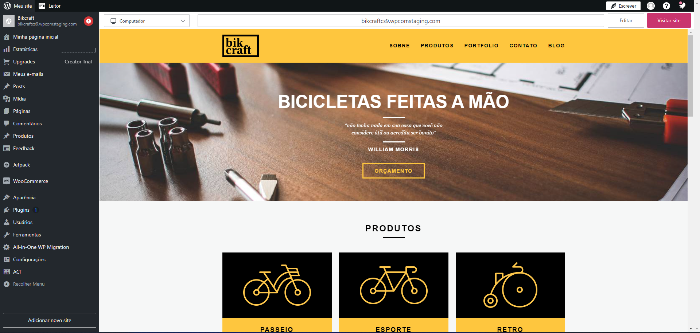

# Bikcraft - Sell your bikes on a modern website 🚲

<br>

<p align="center">
  <a href="#-about-the-project">About the project</a> •
  <a href="#-technologies">Technologies</a> •
<a href="#-getting-started">Getting started</a> •
<a href="#-license">License</a>

</p>

<p align="center">

  
 
  
</p>

## 👩‍💻 About the project

This project is a website dedicated to selling bicycles, complemented by a blog and a contact form for a complete user experience.

Although it looks like a simple implementation with pure HTML, CSS and JavaScript, this site has a significant advantage: it is fully manageable through WordPress, one of the most popular and powerful Content Management System (CMS) available.

A CMS is designed to make life easier for you and your customers. Because it allows you to easily manage the content of your website through an interface that anyone can learn.

This project uses WordPress advanced features, such as advanced custom fields and custom post types, to offer an even more personalized and adaptable experience.

[click here, see closer](https://bikcraftcs9.wpcomstaging.com/) 😉

## 🚀 Technologies

- [Local](https://localwp.com/)
- [Advanced Custom Fields](https://www.advancedcustomfields.com/resources/file/)
- [WordPress.com](https://wordpress.com/pt-br/)

## 💻 Getting started

### Requirements

- [Local](https://localwp.com/)
- [wordpress.org](https://br.wordpress.org/)
- [WordPress.com](https://wordpress.com/pt-br/)

**Clone the project**

```bash
$ git clone https://github.com/leandrorodrigues00/bikcraft-wordpress

```

The main purpose of [Local](https://localwp.com/) is to make it easier to install and manage instances of WordPress in your local development environment. It automatically installs WordPress on your computer, creating a complete development environment ready for use.

To start using the project, clone this repository into your WordPress themes folder. You can do this at: `your-folder\app\public\wp-content\themes`. Make sure you already have WordPress with the [local](https://localwp.com/) .

After cloning the repository, you need to create the pages in the WordPress admin panel. You also need to add editable fields using the Advanced Custom Fields plugin within the same admin panel.

## 📝 License

This project is licensed under the MIT License - see the [LICENSE](LICENSE) file for details.

---

<p align="center">
  Made with 💜&nbsp; by  Leandro Rodrigues
</p>
